# Branching using Visual Studio Code

## Table of contents
  - [Create a local side branch](#create-a-local-side-branch)
  - [Commit your changes to your online side branch](#commit-your-changes-to-your-online-side-branch)
  - [Pull Request: add your side branch changes to main branch](#pull-request-add-your-side-branch-changes-to-main-branch)
  - [Main Branch Policies](#main-branch-policies)

---

## Create a local side branch
1. In VS code click bottom left corner on the branch icon.\
   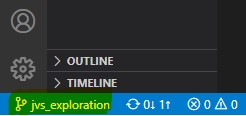
2. Select "+ Create new branch from"\
   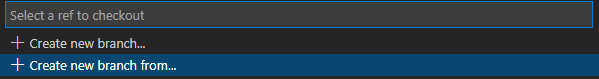
3. Type a meaningful new branch name and press enter\
   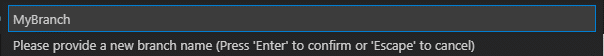
4. Select the branch from which you want to create a new branch. Most likely this will be "Main branch" from Origin online (Main branch in DevOps).\
   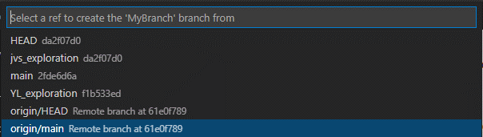

   >The active branch is now the new created branch (see bottom left corner), based on the situation of the main branch. 

## Commit your changes to your online side branch
1. Work on your Code as usual. 
2. Commit your new branch with your code changes to DevOps.
   - There is a commit signal\
   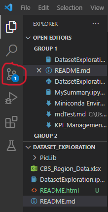
     > If your new (local) side branch was not yet synced to the online repository then that will happen along with your first changes following the steps below. 
   - Choose the changes that you want to `'Stage'` by clicking on the `'+' Icon`. Staging means basically that you line up these changes to be send to your online repository.\
   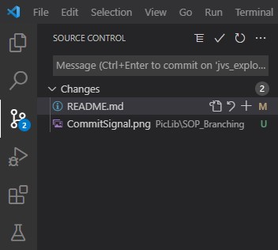
   - The `Staged` changes are now ready to be send to the online repository. Provide a short meaningfull name for your commit and click the `V Icon`.\
   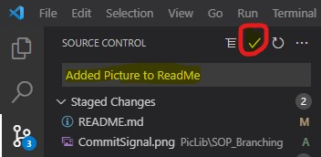
3. Now sync your local changes with the online version by clicking 'Sync Changes'.\
   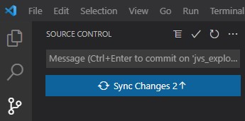
4. You can continue working on your local side branch whenever you want.

### Pull Request: add your side branch changes to main branch
> The following steps are performed online in Azure DevOps. Once you think your side code is ready for review and to merge to the main branch you can create a `pull request` on DevOps
1. Go to DevOps online environment; Click "Repos" and then "Pull Requests"\
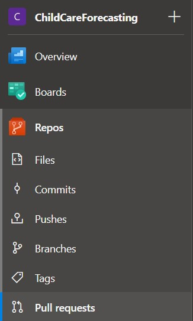
2. Click button "New Pull Request".\
   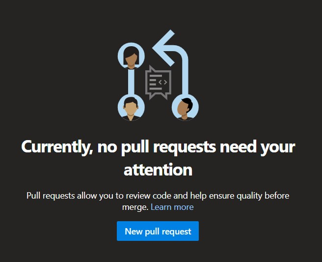
3. Fill in details in the popup and click "Create"\
   
   > Make sure you request to do a pull from the correct branch into the correct other branch
4. Review and perform the action (Approve or Reject)\
   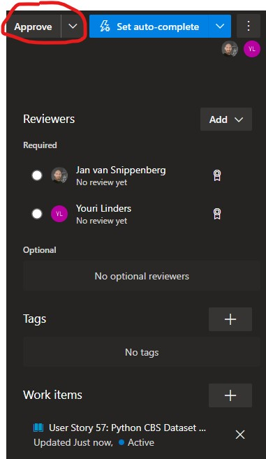
5. When approved, click button "Complete" or "Set auto-complete.
6. Check/Uncheck the options you wish and click "Complete".\
   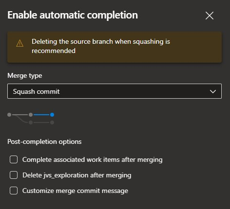
7.  Depending on the set branch policies, the main branch is updated with the changes made in the side branch. 
 
    > **Note:** When the branch policies are set in such a way that multiple reviewers need to approve the changes, then the main branch is updated only once all reviewers have approved the changes. 

### Main Branch Policies
Branch policies are an important part of the Git workflow and enable us to:
- Isolate work in progress from the completed work in your main branch
- Guarantee changes build before they get to main
- Limit who can contribute to specific branches
- Enforce who can create branches and the naming guidelines for the branches
- Automatically include the right reviewers for every code change
- Enforce best practices with required code reviewers
  
We have set the following branch policies on the main branch in the repo section
- **Require minumum number of reviewers**
  - value = 2: we are working with 2 developers on this branch
  - Allow requesters to approve their own changes
    - value = Yes; because it's just 2 devolopers working on this branch. Besides we force the requester to review his own changes.
  
   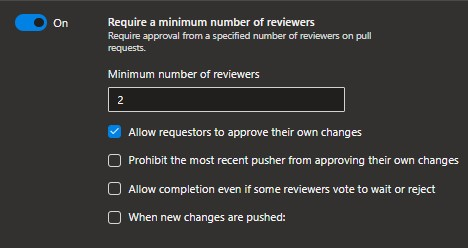

- **Check for linked work items**
  - Value = Required; all commits and code review are then tracked in the board workitem of the developer in question. 
  
  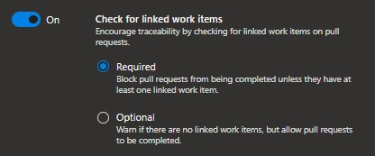

- **Check for comment resolution**
  - Value = Required; all individual commmits have to be reviewd. 
  
  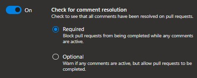

- **Limit merge types**
  - Allowed merge types is `Squash merge` only.
  - This means that on the master branch line only sub lines are shown for pull requests and not for every commit in a particular pull request.
  - This gives a much cleaner branch line to review where changes were made. 
  
  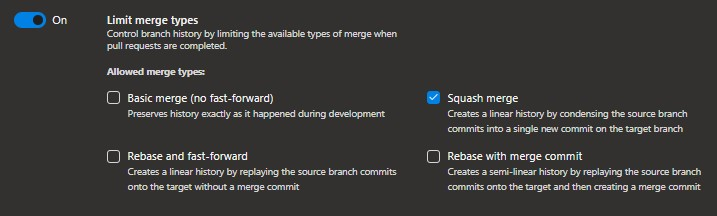
   

<head>
   <link rel="stylesheet" href="styles.css">.
</head>

